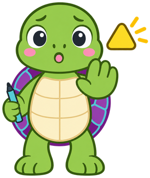
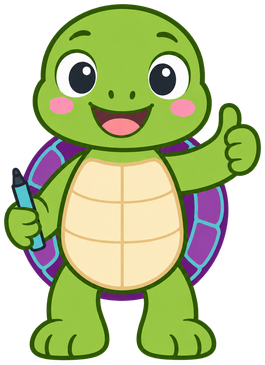
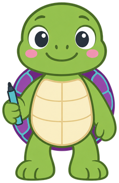

# Draw a Square

<strong>Level:</strong> Beginner &middot;
<strong>Time:</strong> 20 minutes &middot;
<strong>Chapter:</strong> <a href="../../chapters/04-motion-coordinates/">4. Motion &amp; Coordinates</a>

!!! mascot-welcome "Cody's Challenge"
    { class="mascot-admonition-img" }
    I want to walk all the way around a square and draw it with my pen as I go.
    I made a start: I go forward, then I turn one corner. But when I click the
    green flag I stop after one side! Can you finish my program so I get all the
    way around and back to where I began?

## What You Will Learn

- How the green flag block starts a program
- How blocks run in order, one after another, from top to bottom
- How **move** and **turn** work together to make a corner
- Why four turns of 90 degrees bring you back to facing the way you started

## Before You Start

You need to know how to drag a block from the palette and snap it under another
block. If you have not done that yet, work through
[Getting Started](../../intro/01-getting-started.md) first.

## The Starter Program

Here is how far I got. The first four blocks get me ready: they clear the stage,
make my pen line thick enough to see, and put my pen down so I draw as I move.
Then I go forward, pause for a second, and turn one corner.

<pre class="blocks">
when green flag clicked
erase all
set pen size to (5)
pen down
move (100) steps
wait (1) seconds
turn right (90) degrees
</pre>

<a href="starter.sb3" download>&#11015; Download starter.sb3</a>

Open it in Scratch with **File &rarr; Load from your computer**. You can also
build these seven blocks yourself — you will remember them better if you do.

!!! mascot-thinking "Predict Before You Run"
    { class="mascot-admonition-img" }
    Do not click the green flag yet. Look at my blocks and answer out loud:
    how many sides will I draw, and how many corners will I turn? Now click the
    flag and see if you were right.

## Your Task

1. Find the three blocks after `pen down`: **move**, **wait**, and **turn**.
   Together they draw one side and turn one corner.
2. Add more blocks under the last one so that I draw a whole square.
3. Click the green flag and watch me go.

!!! mascot-tip "Cody's Tip"
    { class="mascot-admonition-img" }
    Count the corners of a square, not the sides. Every corner I turn is 90
    degrees. What do you get when you add up all four corners?

!!! mascot-warning "Watch Out"
    { class="mascot-admonition-img" }
    It is easy to add all the **move** blocks first and then the **turn** blocks
    at the end. If you do that I walk one very long line and then spin around on
    the spot. Each move needs its own turn right after it.

## Check Your Work

Your program is right when all four of these are true:

- There are four sides on the stage, all the same length
- The shape is closed — no gap where the last side meets the first
- I finish standing exactly where I started
- I finish facing the same direction I started, straight up

??? mascot-encourage "Stuck? Open this hint"
    { class="mascot-admonition-img" }
    Look at the group of three blocks that draws one side: move, wait, turn.
    A square has four sides. How many times does that group of three blocks
    need to appear in the program?

## The Solution

??? note "Click to reveal the finished program"
    Try the challenge yourself first. You will remember it far longer.

    <pre class="blocks">
    when green flag clicked
    erase all
    set pen size to (5)
    pen down
    move (100) steps
    wait (1) seconds
    turn right (90) degrees
    move (100) steps
    wait (1) seconds
    turn right (90) degrees
    move (100) steps
    wait (1) seconds
    turn right (90) degrees
    move (100) steps
    wait (1) seconds
    turn right (90) degrees
    </pre>

    

    <a href="solution.sb3" download>&#11015; Download solution.sb3</a>
    

    Four sides and four corners. Each corner turns me 90 degrees, and
    4 &times; 90 = 360 — a whole circle — which is why I end up facing exactly
    the way I started.

    The `wait 1 seconds` blocks are not part of the square at all. They only
    slow me down so you can watch each side being drawn. Take them out and I
    finish in a blink.

!!! mascot-celebration "You Did It!"
    { class="mascot-admonition-img" }
    You just wrote a **sequence** — a stack of blocks that run in order, top to
    bottom. That is what every program is made of, no matter how big it gets.
    You also found the rule that hides inside every shape I draw: the corners
    always add up to a full turn.

## Go Further

Try these one at a time, and click the green flag after each change:

1. Change every `100` to `200`. What happens to the square?
2. Delete the four `wait` blocks. What changes, and what stays the same?
3. Change one side's `100` to `50`. What shape do you get now?
4. Change every turn from `90` to `120`, and use only three sides. What shape
   appears? Why does that work?

!!! mascot-neutral "Where This Goes Next"
    { class="mascot-admonition-img" }
    Look at how much dragging that took — twelve blocks to say the same thing
    four times over. Next I will show you the `repeat` block, which draws this
    exact square with three blocks instead of twelve. See
    [Loops](../../intro/05-loops.md).

## Blocks Used in This Lab

| Block | Palette | What It Does |
|-------|---------|--------------|
| `when green flag clicked` | Events | Starts the script when you click the green flag |
| `erase all` | Pen | Wipes away anything drawn before |
| `set pen size to (5)` | Pen | Makes the line thick enough to see |
| `pen down` | Pen | Starts drawing a line wherever I move |
| `move (100) steps` | Motion | Moves me forward in the direction I am facing |
| `wait (1) seconds` | Control | Pauses so you can watch me draw |
| `turn right (90) degrees` | Motion | Turns me 90 degrees clockwise |

## Concepts Covered

From [Chapter 4: Motion & Coordinates](../../chapters/04-motion-coordinates/index.md)
and [Chapter 3: Sequencing & Scripts](../../chapters/03-sequencing-scripts/index.md):

- When Green Flag Clicked
- Sequencing
- Script
- Move Steps Block
- Turn Right Block
- Degrees Of Turn
